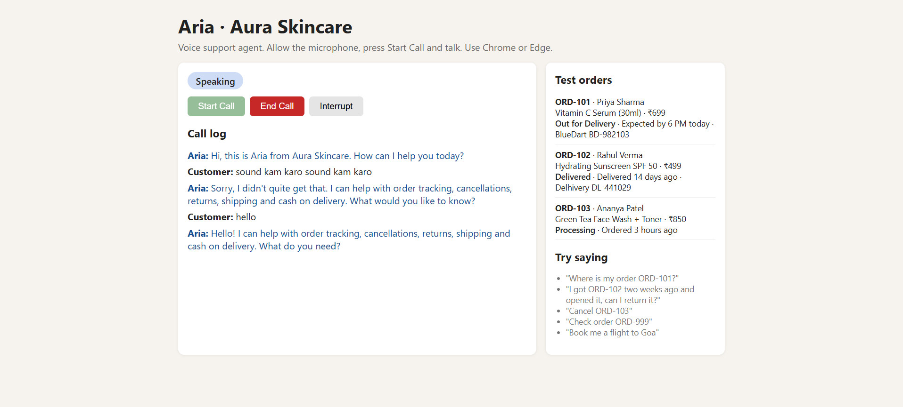

# Aria — AI Voice Support Agent for Aura Skincare

A browser-based voice customer support agent for a fictional D2C skincare brand. Click **Start Call**, speak naturally, and Aria answers using brand policies and live order lookups. When the call ends, you get a transcript and a structured JSON outcome.

**Live demo:** [aura-voice-agent-liard.vercel.app](https://aura-voice-agent-liard.vercel.app/)
Use **Chrome or Edge** and allow microphone access.



---

## Features

- Natural voice conversation in the browser, with no telephony setup
- Indian English voice (`en-IN`)
- Live state indicator: Listening, Thinking, Speaking
- Order lookup through tool functions: `get_order_details`, `cancel_order`
- Policy enforcement for returns, cancellations, shipping and COD
- Graceful handling of invalid or missing order IDs, unclear audio, and out-of-scope requests
- Interrupt button to stop the agent mid-sentence
- Post-call transcript and structured JSON summary
- Test orders panel on the page, so order lookups can be tried right away
- Runs with no API keys and no LLM

## Tech stack

| Layer | Technology |
|---|---|
| Frontend | Vite + React |
| Backend | Flask (Python) |
| Speech-to-text | Browser Web Speech API (`SpeechRecognition`) |
| Text-to-speech | Browser `speechSynthesis` |
| Agent | Rule-based dialogue manager (`backend/agent.py`) |
| Data | In-memory mock orders (`backend/orders.py`) |
| Hosting | Vercel (static frontend + Python serverless function) |

## Architecture

```
Microphone
   |
SpeechRecognition (browser)
   |  text
   v
POST /api/chat  { text, context }
   |
   |  agent.respond():
   |    1. detect intent (regex rules)
   |    2. extract order ID, days, opened/unopened
   |    3. call tools (get_order_details / cancel_order)
   |    4. enforce policy and choose reply
   v
{ reply, context }
   |
speechSynthesis (browser)  ->  Speakers
```

- **Stateless server:** the conversation state (`context`) is returned to the browser and sent back with each turn, so the backend runs well on serverless platforms.
- **Summary:** on End Call, `POST /api/summary` builds the JSON outcome from the call context.
- **Guardrails live in code:** replies come from templates driven by the policy rules, so the agent cannot be talked into promising a refund outside policy.

## Quick start

### Prerequisites
- Python 3.9+
- Node.js 18+
- Chrome or Edge

### 1. Clone the repo
```bash
git clone https://github.com/chalakbilla/aura-voice-agent.git
cd aura-voice-agent
```

### 2. Launch with one command

**macOS / Linux**
```bash
chmod +x run.sh
./run.sh
```

**Windows**
```bat
run.bat
```

The script creates a Python virtual environment, installs backend and frontend dependencies, and starts both servers in a single terminal.

| Service | URL |
|---|---|
| Frontend | http://localhost:5173 |
| Backend | http://localhost:5000 |

Press `Ctrl+C` to stop both.

### Manual run (optional)
```bash
# Terminal 1 - backend
cd backend
python -m venv venv
source venv/bin/activate        # Windows: venv\Scripts\activate
pip install -r requirements.txt
python app.py

# Terminal 2 - frontend
cd frontend
npm install
npm run dev
```

## Test scenarios

Sample orders are shown on the page.

| Order | Customer | Product | Value | Status |
|---|---|---|---|---|
| ORD-101 | Priya Sharma | Vitamin C Serum (30ml) | ₹699 | Out for Delivery |
| ORD-102 | Rahul Verma | Hydrating Sunscreen SPF 50 | ₹499 | Delivered 14 days ago |
| ORD-103 | Ananya Patel | Green Tea Face Wash + Toner | ₹850 | Processing |

| Say this | Expected behaviour |
|---|---|
| "Where is my order ORD-101?" | Looks up the order and reports it is out for delivery by 6 PM |
| "I bought this 20 days ago and opened it. Can I return it?" | Politely explains it is outside the return policy |
| "Cancel ORD-103" | Confirms, then cancels (status is Processing) |
| "Cancel ORD-101" | Declines (already out for delivery), mentions refusing at the doorstep |
| "Check order ORD-999" | Says no such order was found and asks to verify the ID |
| "Where is my order?" | Asks for the order ID |
| "Book me a flight to Goa" | Says it can only help with Aura Skincare queries |
| "Is cash on delivery available?" | Explains COD up to ₹2,500, cash or UPI |

## Post-call output

```json
{
  "customer_intent": "ORDER_TRACKING",
  "order_id": "ORD-101",
  "resolution_status": "RESOLVED",
  "call_summary": "Order ORD-101 is out for delivery. Expected by 6 PM today."
}
```

`resolution_status` is one of `RESOLVED`, `UNRESOLVED`, `POLICY_DECLINED`, `OUT_OF_SCOPE`, `INCOMPLETE`.

## API

| Method | Endpoint | Description |
|---|---|---|
| GET | `/api/orders` | Returns the mock order database |
| POST | `/api/chat` | Body: `{ text, context }`. Returns `{ reply, context, intent, tool_calls }` |
| POST | `/api/summary` | Body: `{ context }`. Returns the structured call outcome |

## Project structure

```
aura-voice-agent/
├── api/index.py          # Vercel serverless entry (loads the Flask app)
├── backend/
│   ├── app.py            # Flask routes
│   ├── agent.py          # Intent detection, policy logic, replies, summary
│   ├── orders.py         # Mock order data and tool functions
│   └── requirements.txt
├── frontend/
│   └── src/              # React UI, voice loop, API client
├── docs/screenshot.png
├── vercel.json
├── run.sh                # macOS / Linux launcher
└── run.bat               # Windows launcher
```

## Deployment (Vercel)

1. Push the repo to GitHub.
2. Import it in Vercel with **Application Preset: Other** and root directory `./`.
3. Deploy. `vercel.json` builds the frontend and routes `/api/*` to the Flask function.

No environment variables are needed.

## Known limitations

- Understanding is rule-based, so unusual phrasings may get a "didn't quite get that" reply. New phrasings can be added in `INTENT_PATTERNS` in `backend/agent.py`.
- Speech quality depends on the browser's built-in recognition and voices; Chrome or Edge is recommended.
- Replies are in English; only a few Hinglish keywords are recognised (for example "kahan", "kab aayega", "wapas", "haan", "nahi").
- Echo can occur on speakers, so the agent stops listening while it speaks. Headphones give the best experience.

---

## Design notes

**1. Why this architecture and stack?**
I wanted a deterministic, free and fast system. Browser speech APIs remove network hops for voice, and a rule-based dialogue manager gives instant replies and makes policy enforcement exact: the reply comes from code, not from a model that might agree to anything. Flask keeps the backend small, and React gives a simple, reliable call UI. The cost is narrower language understanding.

**2. What was the most difficult part, and how did I solve it?**
Keeping a conversation coherent without an LLM. Follow-ups like "yes", "it's unopened" or a bare "101" only make sense with context. I solved it with a small context object (pending question, last order, topic, outcomes) that the client returns every turn, which also keeps the server stateless. The second challenge was turn-taking: recognition picks up the agent's own voice, so the app stops listening while Aria speaks and resumes afterwards.

**3. With one more week, what would I improve first?**
Add an LLM purely for understanding (intent and entity extraction) while keeping policy checks and tools in code. This handles free-form phrasing and Hinglish better and keeps the guardrails deterministic. After that: streaming speech with true barge-in and a higher-quality Indian-accent TTS.

**4. What would change at 1,000 conversations a day?**
Persist calls, transcripts and summaries in Postgres; add authentication, rate limiting and monitoring; move to server-side streaming STT/TTS for consistent quality across browsers; log unrecognised utterances to expand coverage; add regression tests for conversation flows; and hand off to a human agent when the bot is unsure.

## Author

[Ankit Raj](https://www.linkedin.com/in/ankitpvxt)